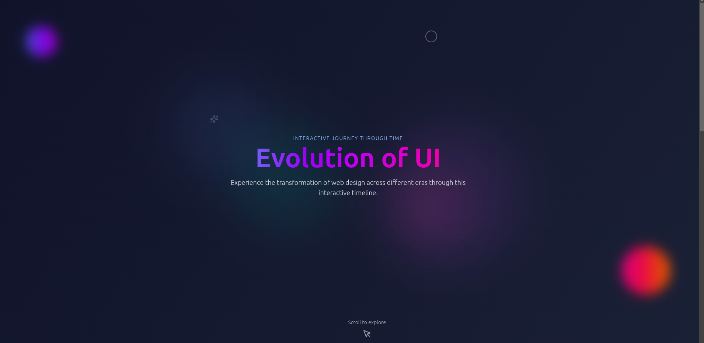
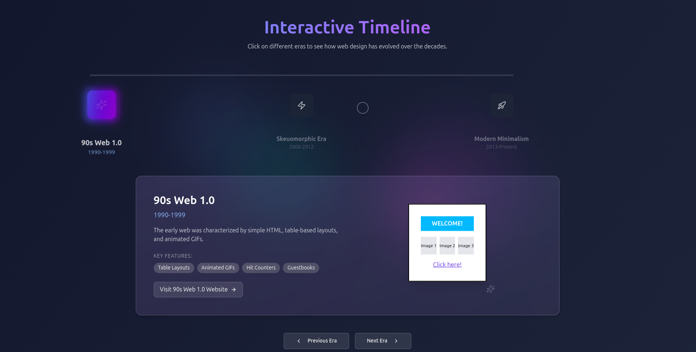
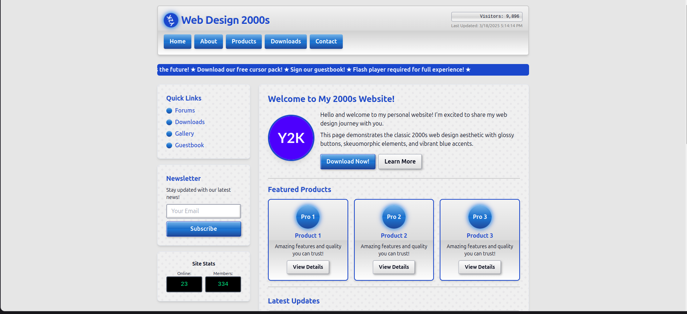

# 🕰️ The Evolution of UI – Websites Across Different Eras  

## Team Members 
- **Anuj A**
- **Harish J**
- **Kirla Siva Sai Karthik**
- **Hari Prasath K**
  
Explore how web design has evolved through the years! This interactive website lets users experience design trends from different eras.

## 🚀 Tech Stack  
- **Frontend:** React.js  
- **Styling:** CSS (Era-accurate themes)  

## 🔥 Features  
✅ **Multiple UI Styles** – Experience:  
   - 🖥️ **90s Web 1.0** – Plain HTML, marquee text, and pixelated graphics  
   - 📱 **Early 2000s Skeuomorphic** – Glossy buttons, drop shadows, and realistic textures  
   - 🎨 **Modern Minimalism** – Flat design, smooth animations, and responsive layouts  

🔄 **Switch Between Eras** – Seamlessly toggle between different UI styles.  

🕹️ **Era-Accurate Functionality** – Each design includes features true to its time period.  


## 📸 Screenshots  

### Landing Page
  
  


### 2000s Style  
  

## 📥 Installation & Setup  

1. Clone the repository:  
   ```bash
   git clone <repo-url>
   cd evolution-of-ui
   ```
2. Install dependencies
    ```bash
    npm install
    ```
3. Run the server
    ```bash
    npm start
    ```

